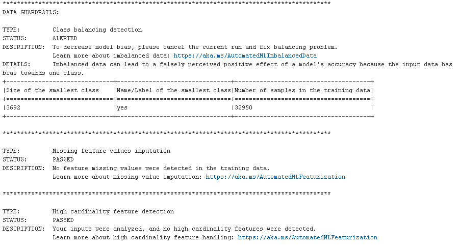
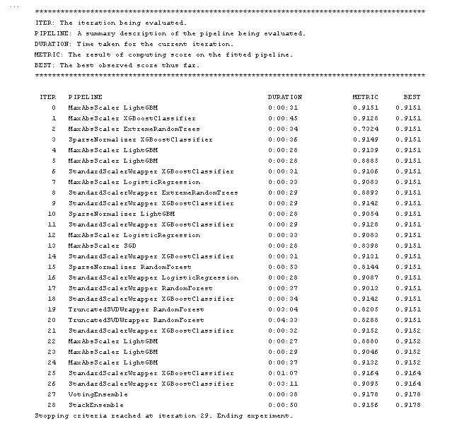
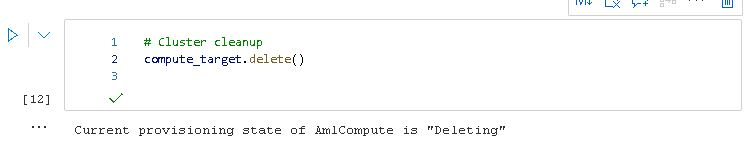

# Optimizing an ML Pipeline in Azure

## Overview
This project is part of the Udacity Azure ML Nanodegree.
In this project, we build and optimize an Azure ML pipeline using the Python SDK and a provided Scikit-learn model.
This model is then compared to an Azure AutoML run.

## Useful Resources
- [ScriptRunConfig Class](https://docs.microsoft.com/en-us/python/api/azureml-core/azureml.core.scriptrunconfig?view=azure-ml-py)
- [Configure and submit training runs](https://docs.microsoft.com/en-us/azure/machine-learning/how-to-set-up-training-targets)
- [HyperDriveConfig Class](https://docs.microsoft.com/en-us/python/api/azureml-train-core/azureml.train.hyperdrive.hyperdriveconfig?view=azure-ml-py)
- [How to tune hyperparamters](https://docs.microsoft.com/en-us/azure/machine-learning/how-to-tune-hyperparameters)


## Summary
The dataset contains applications of candidates for a bank service. We are looking to predict a candidate's 
application result based on features included in the dataset such as their job, marital status,...etc. 

The best performing model was found to be the VotingEnsemble from AutomML with an accuracy of 91.88%.
The best performing HyperDrive Logistic Regression model came in with an accuracy of 90.88%.

## Scikit-learn Pipeline

The first part of the process involves setting up the pipeline for cleaning and preprocessing the data for use in our ML pipelines.
The dataset is called bankmarketing_train.csv file and is stored on Azure blob storage. The dataset contains data on 
applicants for a banking service. The dataset contains 32,950 observations and 21 columns. We are looking to predict 
the value of y as 'yes' or 'no'. The preprocessing is accomplished with the help of `train.py`. This script has a function 
*clean_data* which returns two datasets x and y. x is the feature dataset with 39 columns and y is the target dataset.

The classification model used for the HyperDrive pipeline is a Logistic Regression model. the logistic model is a statistical
model that models the probability of an event taking place by having the log-odds for the event be a linear combination 
of one or more independent variables. 

There are then three broad categories which cover the ML pipeline:

**1. Sampling Methods:**

This helps us choose suitable parameters for our model. We have several choices such as random sampling, grid search, 
bayesian sampling to name a few. These will vary based on the model of interest and can be continuous or discrete values.

**2. Early Stopping Policy:**

This part of the pipeline establishes the stopping criterion for the chosen sampling method to automatically terminate. 
It helps to eliminate unnecessary compute time.

We use a BanditPolicy as our stopping criteria with evaluation interval at 2 and slack factor equals 0.1. 

**3. Performance Metrics:**

A performance metric is required to be specified in the configuration so the optimizer knows whether 
this metric has to be maximized or minimized. The parameters are tuned with accuracy as the performance metric with the 
goal to maximize it. 

I chose a RandomParameter sampler to avoid long compute time as compared to doing an exhaustive grid search with minimal
loss in accuracy.
The parameter C is used to prevent over fitting while the max_iter helps reduce the overall compute time. Choice of these
two parameters helps the algorithm search over the appropriate space without and prevents the process from running too long.


I have chosen a BanditPolicy and set the evaluation_interval to 2 and the slack_factor to 0.1. This evaluates the primary 
metric every 2 iteration and if the value falls outside top 10% of the primary metric then the training process will stop. 
This saves us from continuing to explore hyperparameters that don't show promise of helping reach our target 
metric. It prevents experiments from running for a long time and using up resources.

We use a bandit policy to stop a run if the target performance metric underperforms the best run so far by a specified margin.
In our case this is 10%. A Median stopping policy on the other hand abandons the run where the target performance metric 
is worse than the median of the running averages for all runs. Using a bandit policy can significantly bring down total
compute time.

## AutoML
The AutoML configuration we have specified is as follows:
```
automl_config = AutoMLConfig(
    experiment_timeout_minutes=30,
    task='classification',
    primary_metric='accuracy',
    training_data=ds,
    label_column_name='y',
    n_cross_validations=5)
 ```

AutoML evaluates a wide variety of models and chooses the one which performs the best in terms of the primary metric
specified. In our case this is accuracy.

AutoML includes guardrails from it's exploration of the data which is illustrated in the image below. The size of the 
smallest class is 3,692 and the number of samples in the training data is 32,950.


It identified VotingEnsemble as the best model stopping at iteration 29.


Using the print_model function on the AutoML VotingEnsemble revealed greater details on the model. I have attached this
output as a text file called *print_model_AutoML_output.txt*. It shows the several classifiers were used with different 
weightings as shown below

- xgboost classifier 1 (0.1)
- lightgbmclassifier (0.2)
- lightgbmclassifier (0.2)
- xgboost classifier 2 (0.1)
- xgboost classifier 3 (0.1)
- sgdclassifierwrapper (0.1)
- extratreesclassifier (0.1)


Although most models perform fairly similar, AutoML found that the best performing model was VotingEnsemble 
with an accuracy of 91.88%

## Pipeline comparison

There is a small difference in performance between the two models. The best HyperDrive model came in with an
accuracy of 90.88% while AutoML (VotingEnsemble) model came in with an accuracy of 91.88%. The HyperDrive architecture is
highly customizable to tune one model allowing a user to explore configurations of sampling, early stopping and parameter tuning while
AutoML tends to be a more robust approach to explore a wide variety of models to gauge overall performance with minimal
modifications to any code. There is a very slight difference in accuracy (1 percentage point). This could be because the 
VotingEnsemble might fit the data slightly better as compared to the logistic regression given it is an ensemble method.

## Future work
We could do some preliminary EDA on the data prior to fitting the model to get a better understanding of the data.
This would help better understand which features to choose as well as interpret results.

We can look to include additional features as well as derived features. We can also think about collecting
more records as well as updated records to train our model on as time passes. These steps will help us improve overall 
accuracy and prevent data drift.

## Proof of cluster clean up

